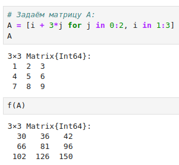

---
## Front matter
lang: ru-RU
title: Лабораторная работа №3
subtitle: Управляющие структуры
author:
  - Клюкин М. А.
institute:
  - Российский университет дружбы народов, Москва, Россия
  

## i18n babel
babel-lang: russian
babel-otherlangs: english

## Formatting pdf
toc: false
toc-title: Содержание
slide_level: 2
aspectratio: 169
section-titles: true
theme: metropolis
header-includes:
 - \metroset{progressbar=frametitle,sectionpage=progressbar,numbering=fraction}
 - \usepackage{fontspec}
 - \usepackage{polyglossia}
 - \setmainlanguage{russian}
 - \setotherlanguage{english}
 - \newfontfamily\cyrillicfont{Arial}
 - \newfontfamily\cyrillicfontsf{Arial}
 - \newfontfamily\cyrillicfonttt{Arial}
 - \setmainfont{Arial}
 - \setsansfont{Arial}
 
---


## Докладчик

:::::::::::::: {.columns align=center}
::: {.column width="70%"}

  * Клюкин Михаил Александрович
  * студент
  * Российский университет дружбы народов
  * [1132226431@pruf.ru](mailto:1132226431@pfur.ru)
  * <https://MaKYaro.github.io/ru/>

:::
::: {.column width="30%"}


:::
::::::::::::::

# Цель работы

Основная цель работы — освоить применение циклов функций и сторонних для Julia
пакетов для решения задач линейной алгебры и работы с матрицами.

# Задание

1. Используя Jupyter Lab, повторите примеры из раздела 3.2.
2. Выполните задания для самостоятельной работы (раздел 3.4).

# Выполнение лабораторной работы

## Цикл while

```Julia
while <условие>
  <тело цикла>
end
```

## Пример использования цикла while

{ #fig:001 width=70% height=70% }

## Пример использования цикла while

{ #fig:002 width=70% height=70% }

## Цикл for

```Julia
for <переменная> in <диапазон>
  <тело цикла>
end
```

## Пример использования цикла for 

{ #fig:003 width=70% height=70% }

## Пример использования цикла for

{ #fig:004 width=70% height=70% }

## Пример использования цикла for

{ #fig:005 width=70% height=70% }

## Пример использования цикла for

{ #fig:006 width=70% height=70% }

## Пример использования цикла for

{ #fig:007 width=70% height=70% }

## Условные выражения

```Julia
if <условие 1>
  <действие 1>
elseif <условие 2>
  <действие 2>
else
  <действие 3>
end
```

## Пример использования условного выражения

{ #fig:008 width=70% height=70% }

## Тернарный оператор

```Julia
a ? b : c
```

## Тернарный оператор

```Julia
if a
  b
else
  c
end
```

## Пример использования тернарного оператора 

{ #fig:009 width=70% height=70% }

# Функции

## Пример написания функций с помощью ключевых слов

{ #fig:010 width=70% height=70% }

## Пример написания функций в одной строке 

{ #fig:011 width=70% height=70% }

## Пример изменения аргумента функции 

{ #fig:012 width=70% height=70% }

## Пример вызова функции map 

{ #fig:013 width=70% height=70% }

## Пример вызова функции broadcast 

{ #fig:014 width=70% height=70% }

## Пример возведения матрицы в квадрат 

{ #fig:015 width=70% height=70% }

## Пример вызова функции broadcast 

{ #fig:016 width=70% height=70% }

## Пример записи математического выражения через функцию bbroadcasr

{ #fig:017 width=70% height=70% }

# Сторонние библиотеки в Julia

## Пример использования пакетов

{ #fig:018 width=70% height=70% }

# Задания для самостоятельного выполнения

## Вывод чисел и их квадратов с помощью цикла while 

{ #fig:019 width=70% height=70% }

## Вывод чисел и их квадратов с помощью цикла for

{ #fig:020 width=70% height=70% }

## Создание словаря

{ #fig:021 width=70% height=70% }

## Создание массива 

{ #fig:022 width=70% height=70% }

## Пример условного оператора

{ #fig:023 width=70% height=70% }

## Пример тернарного оператора 

{ #fig:024 width=70% height=70% }

## Пример функции 

{ #fig:025 width=70% height=70% }

## Пример использования map 

{ #fig:026 width=70% height=70% }

## Пример возведения матрицы в степень 

{ #fig:027 width=70% height=70% }

## Пример замены столбца в матрице 

{ #fig:028 width=70% height=70% }

## Создание матрицы B 

{ #fig:029 width=70% height=70% }

## Вычисление матрицы $B^T B$

{ #fig:030 width=70% height=70% }

## Создание матриц Z, E, Z1 

{ #fig:031 width=70% height=70% }

## Создание матриц Z2 

{ #fig:032 width=70% height=70% }

## Создание матриц Z3

{ #fig:033 width=70% height=70% }

## Создание матриц Z3

{ #fig:034 width=70% height=70% }

## Создание функции outer 

{ #fig:035 width=70% height=70% }

## Создание матрицы $A_1$ 

{ #fig:036 width=70% height=70% }

## Создание матрицы $A_2$ 

{ #fig:037 width=70% height=70% }

## Создание матрицы $A_3$ 

{ #fig:038 width=70% height=70% }

## Создание матрицы $A_4$ 

{ #fig:039 width=70% height=70% }

## Создание матрицы $A_5$ 

{ #fig:040 width=70% height=70% }

## Решение системы линейных уравнений 

{ #fig:041 width=70% height=70% }

## Создание матрицы M 

{ #fig:042 width=70% height=70% }

## Поиск числа элементов в каждой строке матрицы $M$ 

{ #fig:043 width=70% height=70% }

## Поиск строк с двумя числами M 

{ #fig:044 width=70% height=70% }

## Поиск столбцов матрицы $M$ 

{ #fig:045 width=70% height=70% }

## Вычиление выражений 

{ #fig:046 width=70% height=70% }

## Выводы

В результате выполнения данной лабораторной работы мы освоили применение циклов функций и сторонних для Julia пакетов для решения задач линейной алгебры и работы с матрицами.