---
## Front matter
title: "Лабораторная работа №3"
subtitle: "Управляющие структуры"
author: "Клюкин Михаил Александрович"

## Generic otions
lang: ru-RU
toc-title: "Содержание"

## Bibliography
bibliography: bib/cite.bib
csl: pandoc/csl/gost-r-7-0-5-2008-numeric.csl

## Pdf output format
toc: true # Table of contents
toc-depth: 2
lof: true # List of figures
lot: true # List of tables
fontsize: 12pt
linestretch: 1.5
papersize: a4
documentclass: scrreprt
## I18n polyglossia
polyglossia-lang:
  name: russian
  options:
	- spelling=modern
	- babelshorthands=true
polyglossia-otherlangs:
  name: english
## I18n babel
babel-lang: russian
babel-otherlangs: english
## Fonts
mainfont: IBM Plex Serif
romanfont: IBM Plex Serif
sansfont: IBM Plex Sans
monofont: IBM Plex Mono
mathfont: STIX Two Math
mainfontoptions: Ligatures=Common,Ligatures=TeX,Scale=0.94
romanfontoptions: Ligatures=Common,Ligatures=TeX,Scale=0.94
sansfontoptions: Ligatures=Common,Ligatures=TeX,Scale=MatchLowercase,Scale=0.94
monofontoptions: Scale=MatchLowercase,Scale=0.94,FakeStretch=0.9
mathfontoptions:
## Biblatex
biblatex: true
biblio-style: "gost-numeric"
biblatexoptions:
  - parentracker=true
  - backend=biber
  - hyperref=auto
  - language=auto
  - autolang=other*
  - citestyle=gost-numeric
## Pandoc-crossref LaTeX customization
figureTitle: "Рис."
tableTitle: "Таблица"
listingTitle: "Листинг"
lofTitle: "Список иллюстраций"
lotTitle: "Список таблиц"
lolTitle: "Листинги"
## Misc options
indent: true
header-includes:
  - \usepackage{indentfirst}
  - \usepackage{float} # keep figures where there are in the text
  - \floatplacement{figure}{H} # keep figures where there are in the text
---

# Цель работы

Основная цель работы — освоить применение циклов функций и сторонних для Julia
пакетов для решения задач линейной алгебры и работы с матрицами.

# Задание

1. Используя Jupyter Lab, повторите примеры из раздела 3.2.
2. Выполните задания для самостоятельной работы (раздел 3.4).

# Выполнение лабораторной работы

## Циклы while и for

Для различных операций, связанных с перебором индексируемых элементов структур
данных, традиционно используются циклы while и for.

Синтаксис while

```Julia
while <условие>
  <тело цикла>
end
```

Пример использования цикла while для формирования элементов массива (рис. [-@fig:001]).

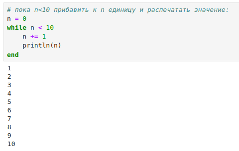{ #fig:001 width=100% height=100% }

Другой пример демонстрирует использование while при работе со строковыми элементами массива, подставляя имя из массива в заданную строку приветствия и выводя
получившуюся конструкцию на экран (рис. [-@fig:002]).

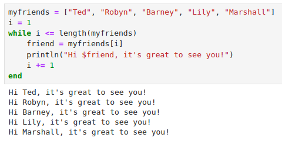{ #fig:002 width=100% height=100% }

Такие же результаты можно получить при использовании цикла for.

Синтаксис for:

```Julia
for <переменная> in <диапазон>
  <тело цикла>
end
```

Рассмотренные выше примеры, но с использованием цикла for (рис. [-@fig:003], [-@fig:004]).

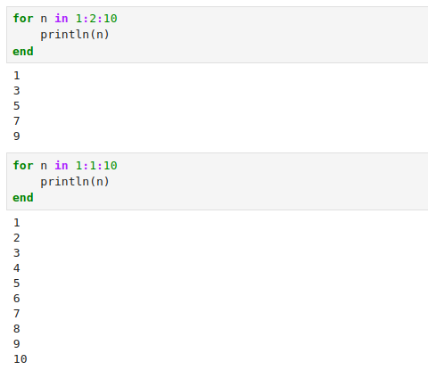{ #fig:003 width=100% height=100% }

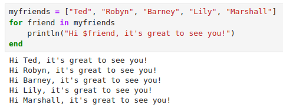{ #fig:004 width=100% height=100% }

Пример использования цикла for для создания двумерного массива, в котором значе-
ние каждой записи является суммой индексов строки и столбца (рис. [-@fig:005]).

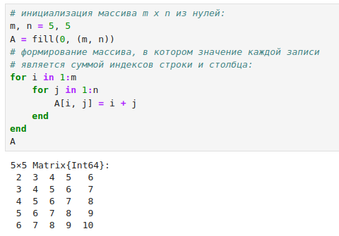{ #fig:005 width=100% height=100% }

Создать двумерный массив также можно и другими способами (рис. [-@fig:006], [-@fig:007]).

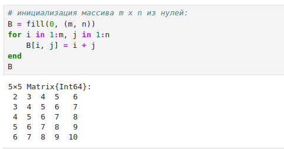{ #fig:006 width=100% height=100% }

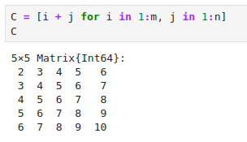{ #fig:007 width=100% height=100% }

## Условные выражения

Довольно часто при решении задач требуется проверить выполнение тех или иных
условий. Для этого используют условные выражения.

Синтаксис условных выражений с ключевым словом:

```Julia
if <условие 1>
  <действие 1>
elseif <условие 2>
  <действие 2>
else
  <действие 3>
end
```

Например, пусть для заданного числа N требуется вывести слово «Fizz», если N делится
на 3, «Buzz», если N делится на 5, и «FizzBuzz», если N делится на 3 и 5 (рис. [-@fig:008]).

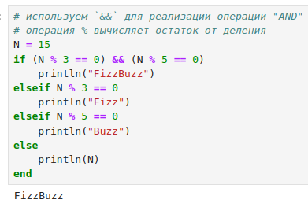{ #fig:008 width=100% height=100% }

Синтаксис условных выражений с тернарными операторами:

```Julia
a ? b : c
```

Такая запись эквивалентна записи условного выражения с ключевым словом:

```Julia
if a
  b
else
  c
end
```

Пример использования тернарного оператора (рис. [-@fig:009]).

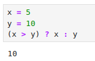{ #fig:009 width=100% height=100% }

## Функции

Julia дает нам несколько разных способов написать функцию. Первый требует ключевых
слов function и end (рис. [-@fig:010]).

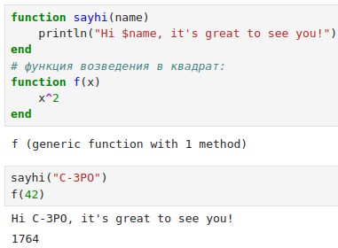{ #fig:010 width=100% height=100% }

В качестве альтернативы, можно объявить любую из выше определённых функций
в одной строке либо как анонимную (рис. [-@fig:011]).

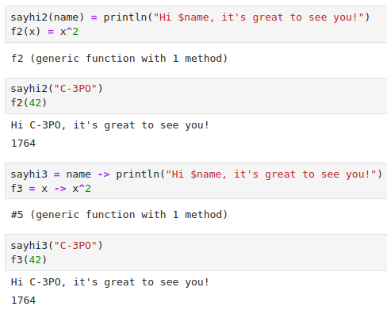{ #fig:011 width=100% height=100% }

По соглашению в Julia функции, сопровождаемые восклицательным знаком, изменяют
свое содержимое, а функции без восклицательного знака не делают этого.
Например, сравните результат применения sort и sort! (рис. [-@fig:012]).

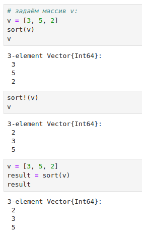{ #fig:012 width=100% height=100% }

В Julia функция map является функцией высшего порядка, которая принимает функцию
в качестве одного из своих входных аргументов и применяет эту функцию к каждому
элементу структуры данных, которая ей передаётся также в качестве аргумента (рис. [-@fig:013]).

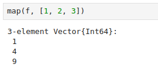{ #fig:013 width=100% height=100% }

Функция broadcast — ещё одна функция высшего порядка в Julia, представляющая собой обобщение функции map. Функция broadcast() будет пытаться привести все объекты
к общему измерению, map() будет напрямую применять данную функцию поэлементно.

Синтаксис для вызова broadcast такой же, как и для вызова map (рис. [-@fig:014]).

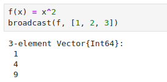{ #fig:014 width=100% height=100% }

Возведение матрицы в квадрат (рис. [-@fig:015]).

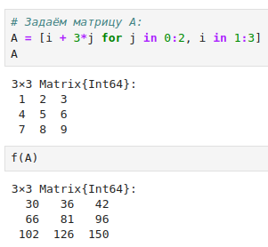{ #fig:015 width=100% height=100% }

Функция broadcast применяет переданную функцию ко всем элементам матрицы (рис. [-@fig:016]).

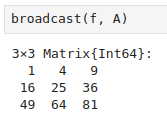{ #fig:016 width=100% height=100% }

Точечный синтаксис для broadcast() позволяет записать относительно сложные со-
ставные поэлементные выражения в форме, близкой к математической записи (рис. [-@fig:017]).

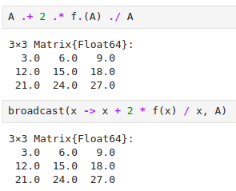{ #fig:017 width=100% height=100% }

## Сторонние библиотеки в Julia

Julia имеет более 2000 зарегистрированных пакетов, что делает их огромной частью
экосистемы Julia. Есть вызовы функций первого класса для других языков, обеспечи-
вающие интерфейсы сторонних функций. Можно вызвать функции из Python или R,
например, с помощью PyCall или Rcall.

При первом использовании пакета в вашей текущей установке Julia вам необходимо
использовать менеджер пакетов, чтобы явно его добавить.

При каждом новом использовании Julia (например, в начале нового сеанса в REPL
или открытии блокнота в первый раз) нужно загрузить пакет, используя ключевое слово
using (рис. [-@fig:018]).

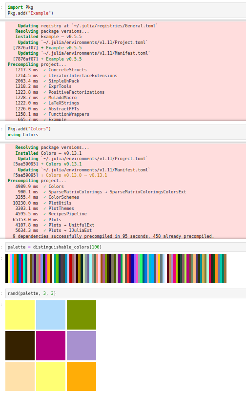{ #fig:018 width=100% height=100% }

# Задания для самостоятельного выполнения

Используя циклы while и for, выведем на экран целые числа от 1 до 100 и напечатаем их квадраты (рис. [-@fig:019], [-@fig:020]).

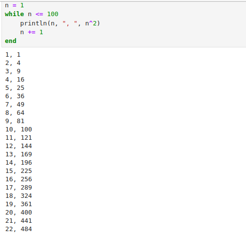{ #fig:019 width=100% height=100% }

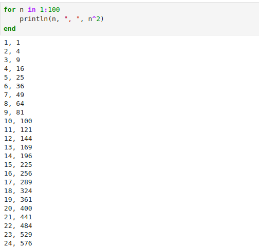{ #fig:020 width=100% height=100% }

Используя циклы while и for, создадим словарь squares, который будет содержать целые числа в качестве ключей и квадраты в качестве их пар-значений (рис. [-@fig:021]).

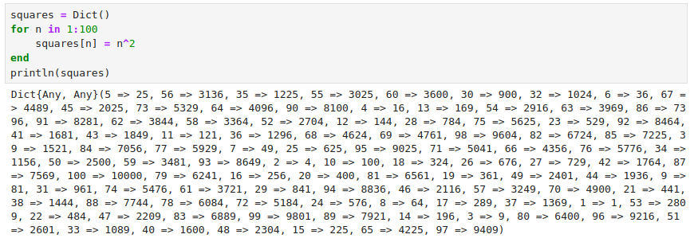{ #fig:021 width=100% height=100% }

Используя циклы while и for, создадим массив squares_arr, содержащий квадраты всех чисел от 1 до 100 (рис. [-@fig:022]).

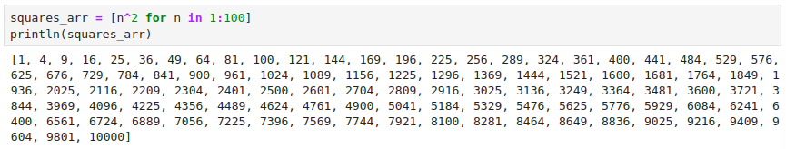{ #fig:022 width=100% height=100% }

Напишем условный оператор, который печатает число, если число чётное, и строку
«нечётное», если число нечётное (рис. [-@fig:023]).

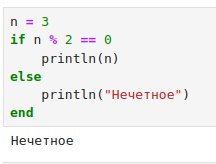{ #fig:023 width=100% height=100% }

Перепишем код, используя тернарный оператор (рис. [-@fig:024]).

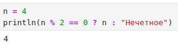{ #fig:024 width=100% height=100% }

Напишем функцию add_one, которая добавляет 1 к своему входу (рис. [-@fig:025]).

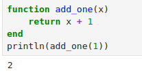{ #fig:025 width=100% height=100% }

Используем map() для задания матрицы A, каждый элемент которой увеличивается на единицу по сравнению с предыдущим (рис. [-@fig:026]).

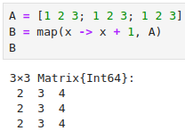{ #fig:026 width=100% height=100% }

Зададим матрицу A и найдем ее куб (рис. [-@fig:027]).

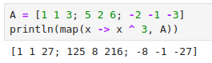{ #fig:027 width=100% height=100% }

Заменим третий столбец матрицы A на сумму второго и третьего столбцов (рис. [-@fig:028]).

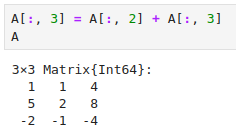{ #fig:028 width=100% height=100% }

Создадим матрицу B с элементами $B_{i1} = 1, B_{i2} = -10, B_{i3} = 10, i = 1, 2, ..., 15$ (рис. [-@fig:029]).

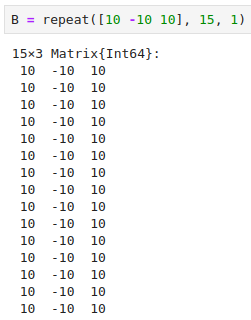{ #fig:029 width=100% height=100% }

Вычислим матрицу $C = B^T B$ (рис. [-@fig:030]).

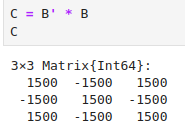{ #fig:030 width=100% height=100% }

Создайте матрицу Z размерности $6 x 6$, все элементы которой равны нулю, и матрицу E, все элементы которой равны 1. Используя цикл for, создадим матрицу $Z_1$ (рис. [-@fig:031]).

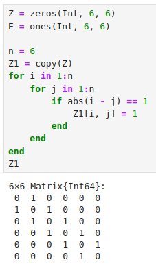{ #fig:031 width=100% height=100% }

Используя цикл for, создадим матрицу $Z_2$ (рис. [-@fig:032]).

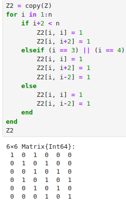{ #fig:032 width=100% height=100% }

Используя цикл for, создадим матрицу $Z_3$ (рис. [-@fig:033]).

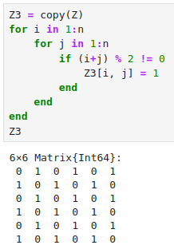{ #fig:033 width=100% height=100% }

Используя цикл for, создадим матрицу $Z_4$ (рис. [-@fig:034]).

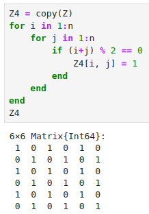{ #fig:034 width=100% height=100% }

Напишем свою функцию, аналогичную функции outer() языка R. Функция должна иметь следующий интерфейс: outer(x,y,operation) (рис. [-@fig:035]). 

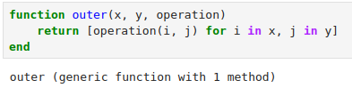{ #fig:035 width=100% height=100% }

Используя написанную функцию outer(), создадим матрицу $A_1$ (рис. [-@fig:036]).

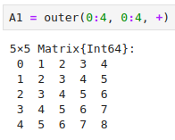{ #fig:036 width=100% height=100% }

Используя написанную функцию outer(), создадим матрицу $A_2$ (рис. [-@fig:037]).

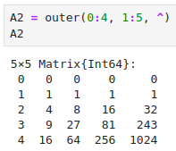{ #fig:037 width=100% height=100% }

Используя написанную функцию outer(), создадим матрицу $A_3$ (рис. [-@fig:038]).

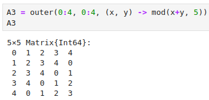{ #fig:038 width=100% height=100% }

Используя написанную функцию outer(), создадим матрицу $A_4$ (рис. [-@fig:039]).

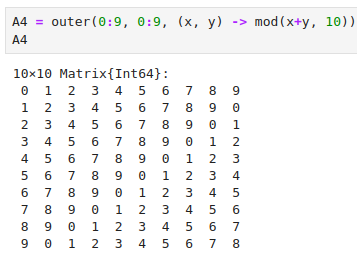{ #fig:039 width=100% height=100% }

Используя написанную функцию outer(), создадим матрицу $A_5$ (рис. [-@fig:040]).

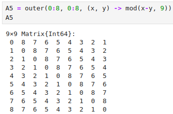{ #fig:040 width=100% height=100% }

Решим следующую систему линейных уравнений с 5 неизвестными (рис. [-@fig:041]).

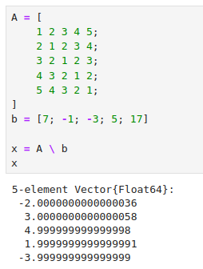{ #fig:041 width=100% height=100% }

Создайте матрицу M размерности $6 x 10$, элементами которой являются целые числа выбранные случайным образом с повторениями из совокупности $1, 2, ... , 10$ (рис. [-@fig:042]).

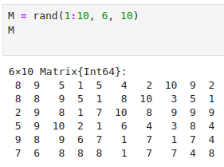{ #fig:042 width=100% height=100% }

Найдите число элементов в каждой строке матрицы $M$, которые больше числа $N$ (например, $N$ = 4) (рис. [-@fig:043]).

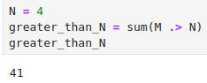{ #fig:043 width=100% height=100% }

Определим, в каких строках матрицы $M$ число M (например, M = 7) встречается
ровно 2 раза (рис. [-@fig:044]).

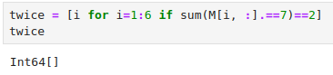{ #fig:044 width=100% height=100% }

Определим все пары столбцов матрицы $M$, сумма элементов которых больше $K$ (например, $K$ = 75) (рис. [-@fig:045]).

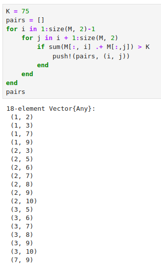{ #fig:045 width=100% height=100% }

Вычислим выражения (рис. [-@fig:046]).

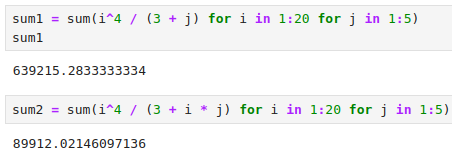{ #fig:046 width=100% height=100% }

# Выводы

В результате выполнения данной лабораторной работы мы освоили применение циклов функций и сторонних для Julia пакетов для решения задач линейной алгебры и работы с матрицами.