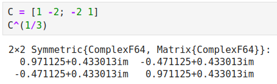

---
## Front matter
lang: ru-RU
title: Лабораторная работа №4
subtitle: Линейная алгебра
author:
  - Клюкин М. А.
institute:
  - Российский университет дружбы народов, Москва, Россия
  

## i18n babel
babel-lang: russian
babel-otherlangs: english

## Formatting pdf
toc: false
toc-title: Содержание
slide_level: 2
aspectratio: 169
section-titles: true
theme: metropolis
header-includes:
 - \metroset{progressbar=frametitle,sectionpage=progressbar,numbering=fraction}
 - \usepackage{fontspec}
 - \usepackage{polyglossia}
 - \setmainlanguage{russian}
 - \setotherlanguage{english}
 - \newfontfamily\cyrillicfont{Arial}
 - \newfontfamily\cyrillicfontsf{Arial}
 - \newfontfamily\cyrillicfonttt{Arial}
 - \setmainfont{Arial}
 - \setsansfont{Arial}
 
---

## Докладчик

:::::::::::::: {.columns align=center}
::: {.column width="70%"}

  * Клюкин Михаил Александрович
  * студент
  * Российский университет дружбы народов
  * [1132226431@pruf.ru](mailto:1132226431@pfur.ru)
  * <https://MaKYaro.github.io/ru/>

:::
::: {.column width="30%"}

:::
::::::::::::::

## Цель работы

Основной целью работы является изучение возможностей специализированных пакетов Julia для выполнения и оценки эффективности операций над объектами линейной алгебры.

## Задание

1. Используя Jupyter Lab, повторитm примеры из раздела 4.2.
2. Выполнитm задания для самостоятельной работы (раздел 4.4).

# Выполнение лабораторной работы

## Поэлементные операции над многомерными массивами

{ #fig:001 width=70% height=70% }

## Поэлементные операции над многомерными массивами

{ #fig:002 width=70% height=70% }

## Поэлементные операции над многомерными массивами

{ #fig:003 width=100% height=100% }

## Поэлементные операции над многомерными массивами

{ #fig:004 width=70% height=70% }

## Поэлементные операции над многомерными массивами

{ #fig:005 width=100% height=100% }

## Поэлементные операции над многомерными массивами

{ #fig:006 width=70% height=70% }

## Поэлементные операции над многомерными массивами

{ #fig:007 width=70% height=70% }

## Вычисление нормы векторов и матриц, повороты, вращения

{ #fig:008 width=70% height=70% }

## Вычисление нормы векторов и матриц, повороты, вращения

{ #fig:009 width=70% height=70% }

## Вычисление нормы векторов и матриц, повороты, вращения

{ #fig:010 width=100% height=100% }

## Вычисление нормы векторов и матриц, повороты, вращения

{ #fig:011 width=70% height=70% }

## Матричное умножение, единичная матрица, скалярное произведение

{ #fig:012 width=70% height=70% }

## Факторизация. Специальные матричные структуры

{ #fig:013 width=70% height=70% }

## Факторизация. Специальные матричные структуры

{ #fig:014 width=70% height=70% }

## Факторизация. Специальные матричные структуры

{ #fig:015 width=70% height=70% }

## Факторизация. Специальные матричные структуры

{ #fig:016 width=70% height=70% }

## Факторизация. Специальные матричные структуры

{ #fig:017 width=100% height=100% }

## Факторизация. Специальные матричные структуры

{ #fig:018 width=100% height=100% }

## Факторизация. Специальные матричные структуры

{ #fig:019 width=100% height=100% }

## Факторизация. Специальные матричные структуры

{ #fig:020 width=70% height=70% }

## Факторизация. Специальные матричные структуры

{ #fig:021 width=70% height=70% }

## Факторизация. Специальные матричные структуры

{ #fig:022 width=100% height=100% }

## Факторизация. Специальные матричные структуры

{ #fig:023 width=70% height=70% }

## Факторизация. Специальные матричные структуры

{ #fig:024 width=70% height=70% }

## Факторизация. Специальные матричные структуры

{ #fig:025 width=70% height=70% }

## Факторизация. Специальные матричные структуры

{ #fig:026 width=70% height=70% }

## Факторизация. Специальные матричные структуры

{ #fig:027 width=70% height=70% }

## Общая линейная алгебра

{ #fig:028 width=70% height=70% }

## Общая линейная алгебра

{ #fig:029 width=70% height=70% }

## Задания для самостоятельного выполнения

{ #fig:030 width=70% height=70% }

## Задания для самостоятельного выполнения

{ #fig:031 width=70% height=70% }

## Задания для самостоятельного выполнения

{ #fig:032 width=70% height=70% }

## Задания для самостоятельного выполнения

{ #fig:033 width=70% height=70% }

## Задания для самостоятельного выполнения

{ #fig:034 width=70% height=70% }

## Задания для самостоятельного выполнения

{ #fig:035 width=70% height=70% }

## Задания для самостоятельного выполнения

{ #fig:036 width=70% height=70% }

## Задания для самостоятельного выполнения

{ #fig:037 width=70% height=70% }

## Задания для самостоятельного выполнения

{ #fig:038 width=70% height=70% }

## Задания для самостоятельного выполнения

{ #fig:039 width=70% height=70% }

## Задания для самостоятельного выполнения

{ #fig:040 width=70% height=70% }

## Задания для самостоятельного выполнения

{ #fig:041 width=70% height=70% }

## Задания для самостоятельного выполнения

{ #fig:042 width=70% height=70% }

## Задания для самостоятельного выполнения

{ #fig:043 width=100% height=100% }

## Задания для самостоятельного выполнения

{ #fig:044 width=100% height=100% }

## Задания для самостоятельного выполнения

{ #fig:045 width=100% height=100% }

## Задания для самостоятельного выполнения

{ #fig:046 width=40% height=40% }

## Задания для самостоятельного выполнения

{ #fig:047 width=70% height=70% }

## Задания для самостоятельного выполнения

{ #fig:048 width=100% height=100% }

## Задания для самостоятельного выполнения

{ #fig:049 width=100% height=100% }

## Задания для самостоятельного выполнения

{ #fig:050 width=70% height=70% }

## Задания для самостоятельного выполнения

{ #fig:051 width=70% height=70% }

## Задания для самостоятельного выполнения

{ #fig:052 width=70% height=70% }

## Задания для самостоятельного выполнения

{ #fig:053 width=70% height=70% }

## Вывод

Изучили возможности специализированных пакетов Julia для выполнения и оценки эффективности операций над объектами линейной алгебры.