---
## Front matter
title: "Лабораторная работа №4"
subtitle: "Линейная алгебра"
author: "Клюкин Михаил Александрович"

## Generic otions
lang: ru-RU
toc-title: "Содержание"

## Bibliography
bibliography: bib/cite.bib
csl: pandoc/csl/gost-r-7-0-5-2008-numeric.csl

## Pdf output format
toc: true # Table of contents
toc-depth: 2
lof: true # List of figures
lot: true # List of tables
fontsize: 12pt
linestretch: 1.5
papersize: a4
documentclass: scrreprt
## I18n polyglossia
polyglossia-lang:
  name: russian
  options:
	- spelling=modern
	- babelshorthands=true
polyglossia-otherlangs:
  name: english
## I18n babel
babel-lang: russian
babel-otherlangs: english
## Fonts
mainfont: IBM Plex Serif
romanfont: IBM Plex Serif
sansfont: IBM Plex Sans
monofont: IBM Plex Mono
mathfont: STIX Two Math
mainfontoptions: Ligatures=Common,Ligatures=TeX,Scale=0.94
romanfontoptions: Ligatures=Common,Ligatures=TeX,Scale=0.94
sansfontoptions: Ligatures=Common,Ligatures=TeX,Scale=MatchLowercase,Scale=0.94
monofontoptions: Scale=MatchLowercase,Scale=0.94,FakeStretch=0.9
mathfontoptions:
## Biblatex
biblatex: true
biblio-style: "gost-numeric"
biblatexoptions:
  - parentracker=true
  - backend=biber
  - hyperref=auto
  - language=auto
  - autolang=other*
  - citestyle=gost-numeric
## Pandoc-crossref LaTeX customization
figureTitle: "Рис."
tableTitle: "Таблица"
listingTitle: "Листинг"
lofTitle: "Список иллюстраций"
lotTitle: "Список таблиц"
lolTitle: "Листинги"
## Misc options
indent: true
header-includes:
  - \usepackage{indentfirst}
  - \usepackage{float} # keep figures where there are in the text
  - \floatplacement{figure}{H} # keep figures where there are in the text
---

# Цель работы

Основной целью работы является изучение возможностей специализированных пакетов Julia для выполнения и оценки эффективности операций над объектами линейной алгебры.

# Задание

1. Используя Jupyter Lab, повторитm примеры из раздела 4.2.
2. Выполнитm задания для самостоятельной работы (раздел 4.4).

# Выполнение лабораторной работы

## Поэлементные операции над многомерными массивами

Для матрицы 4 x 3 рассмотрим поэлементные операции сложения и произведения её элементов (рис. [-@fig:001], [-@fig:002]):

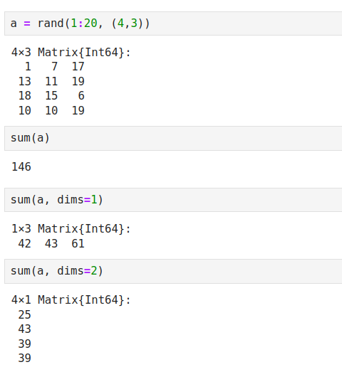{ #fig:001 width=100% height=100% }

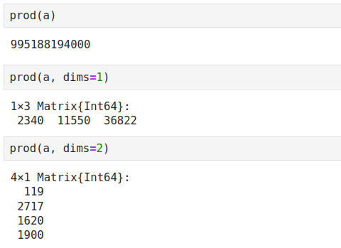{ #fig:002 width=100% height=100% }

Для работы со средними значениями можно воспользоваться возможностями пакета Statistics (рис. [-@fig:003]):

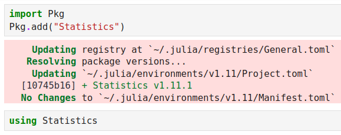{ #fig:003 width=100% height=100% }

Используя этот пакет, найдем среднее значение всей матрицы, средние значения по столбцам и по строкам (рис. [-@fig:004]).

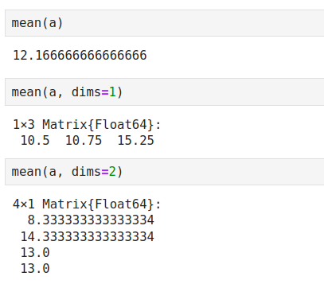{ #fig:004 width=100% height=100% }

Для выполнения таких операций над матрицами, как транспонирование, диагонализация, определение следа, ранга определителя матрицы и т.п. можно воспользоваться библиотекой (пакетом) LinearAlgebra (рис. [-@fig:005]):

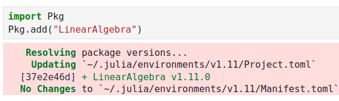{ #fig:005 width=100% height=100% }

Создадим матрицу 4 х 4 со случайными целыми числами из интервала от 1 до 20, транспонируем ее, найдем след, создадим массив из диагональных элементов, найдем ранг, обратную матрицу, детерминант и псевдообратную матрицу для матрицы из предыдущего примера (рис. [-@fig:006], [-@fig:007]).

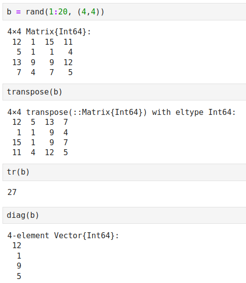{ #fig:006 width=100% height=100% }

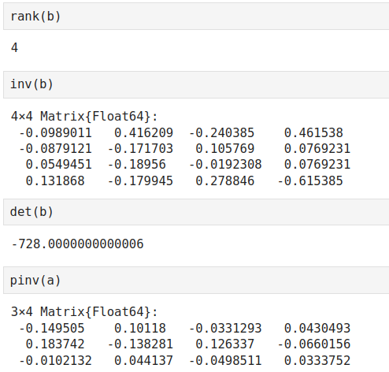{ #fig:007 width=100% height=100% }

## Вычисление нормы векторов и матриц, повороты, вращения

Для вычисления нормы используется LinearAlgebra.norm(x).

Создадим вектор X, вычислим евклидову норму и p-норму (рис. [-@fig:008]).

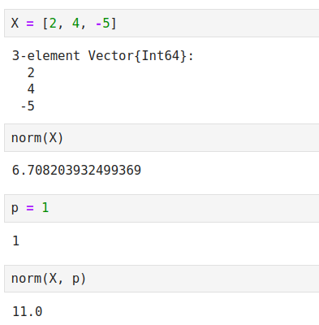{ #fig:008 width=100% height=100% }

Создадим второй вектор Y, найдем расстояние между X и Y (рис. [-@fig:009]).

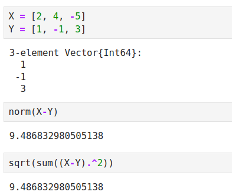{ #fig:009 width=100% height=100% }

Найдем угол между векторами X и Y (рис. [-@fig:010]).

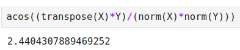{ #fig:010 width=100% height=100% }

Вычислим нормы для двумерной матрицы, а также повернем ее на 180 градусов, перевернем строки и столбцы (рис. [-@fig:011]).

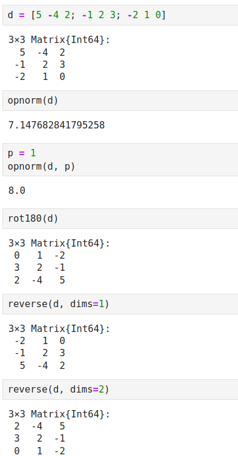{ #fig:011 width=100% height=100% }

## Матричное умножение, единичная матрица, скалярное произведение

Создадим случайные матрицы 2 х 3 и 3 х 4, найдем их произведение. Создадим единичную матрицу. Создадим два вектора X и Y, найдем их скалярное произведение (рис. [-@fig:012]).

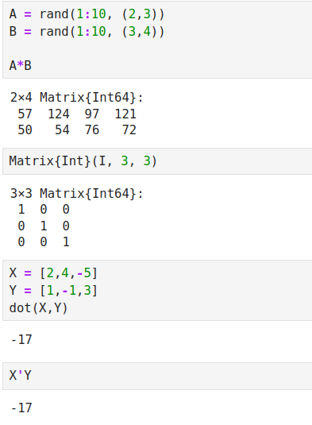{ #fig:012 width=100% height=100% }

## Факторизация. Специальные матричные структуры

Для работы со специальными матричными структурами потребуется пакет LinearAlgebra.

Решим систему линейный алгебраических уравнений Ax = b (рис. [-@fig:013]):

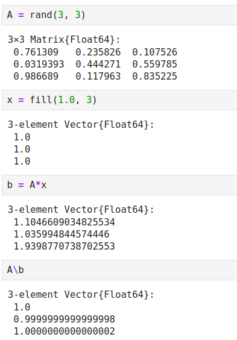{ #fig:013 width=100% height=100% }

Julia позволяет вычислять LU-факторизацию и определяет составной тип факторизации для его хранения (рис. [-@fig:014]):

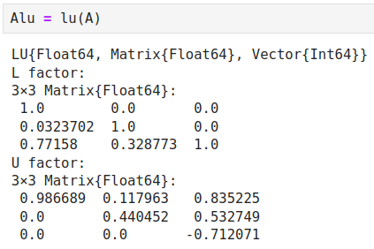{ #fig:014 width=100% height=100% }

Различные части факторизации могут быть извлечены путём доступа к их специальным свойствам (рис. [-@fig:015]).

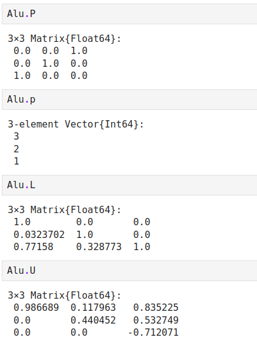{ #fig:015 width=100% height=100% }

Решим исходную систему, используя объекты факторизации (рис. [-@fig:016]).

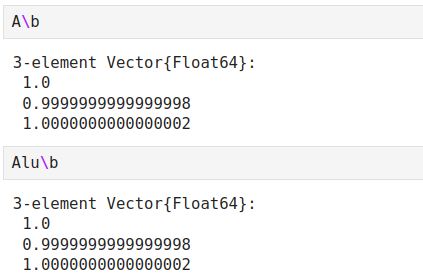{ #fig:016 width=100% height=100% }

Найдем детерминант матрицы A (рис. [-@fig:017]).

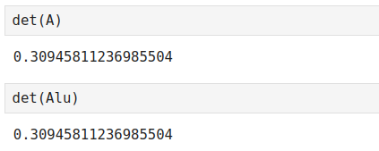{ #fig:017 width=100% height=100% }

Julia позволяет вычислять QR-факторизацию и определяет составной тип факторизации для его хранения (рис. [-@fig:018]).

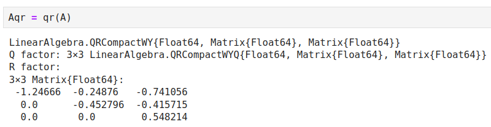{ #fig:018 width=100% height=100% }

По аналогии с LU-факторизацией различные части QR-факторизации могут быть извлечены путём доступа к их специальным свойствам (рис. [-@fig:019]).

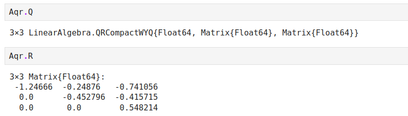{ #fig:019 width=100% height=100% }

Проведем проверку ортогональности матрицы Q, проведем симметризацию матрицы A (рис. [-@fig:020]).

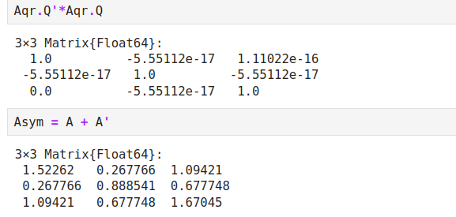{ #fig:020 width=100% height=100% }

Сделаем спектральное разложение симметризованной матрицы, найдем собственные векторы и собственные значения (рис. [-@fig:021]).

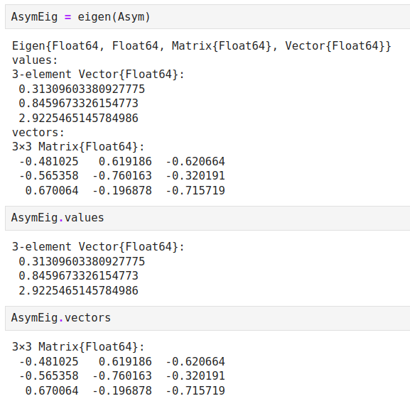{ #fig:021 width=100% height=100% }

Проверим, что получилась единичная матрица (рис. [-@fig:022]).

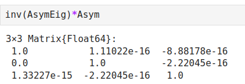{ #fig:022 width=100% height=100% }

Далее рассмотрим примеры работы с матрицами большой размерности и специальной структуры. Создадим матрицу 1000 х 1000 (рис. [-@fig:023]).

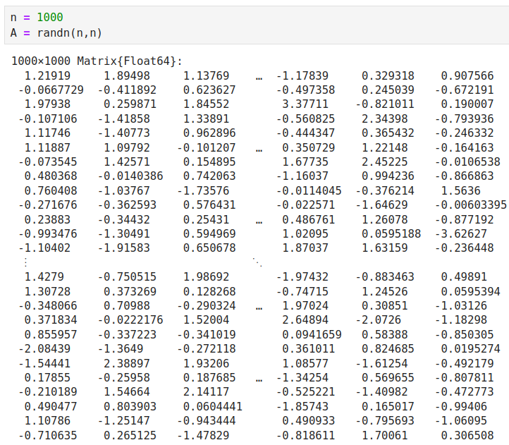{ #fig:023 width=100% height=100% }

Симметризуем матрицу A и проверим, что она явдяется симметричной (рис. [-@fig:024]).

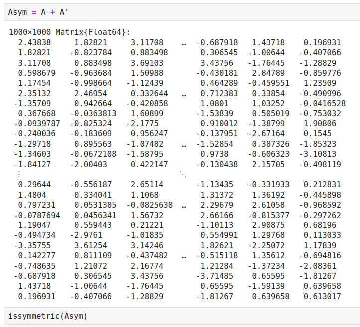{ #fig:024 width=100% height=100% }

Добавим шум в симметричную матрицу. После этого она уже не будет симметричной (рис. [-@fig:025]).

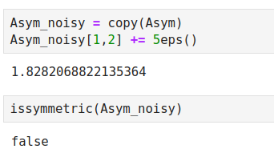{ #fig:025 width=100% height=100% }

В Julia можно объявить структуру матрица явно, например, используя Diagonal, Triangular, Symmetric, Hermitian, Tridiagonal и SymTridiagonal. Явно укажем, что матрица является симметричной (рис. [-@fig:026]).

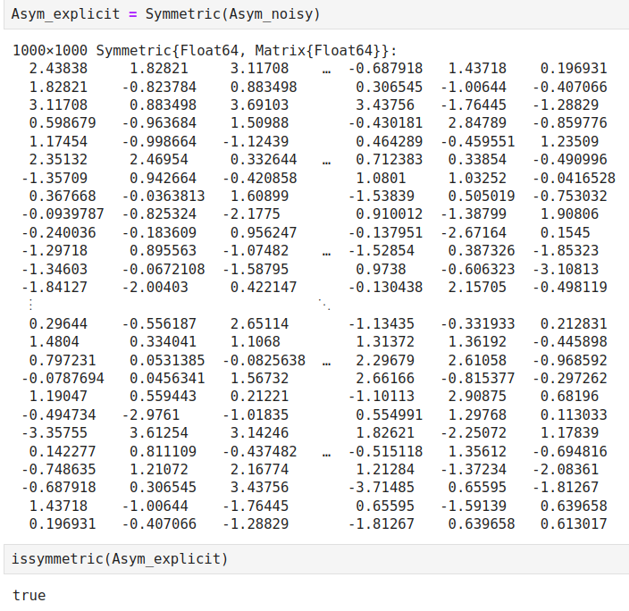{ #fig:026 width=100% height=100% }

Далее для оценки эффективности выполнения операций над матрицами большой размерности и специальной структуры воспользуемся пакетом BenchmarkTools (рис. [-@fig:027]).

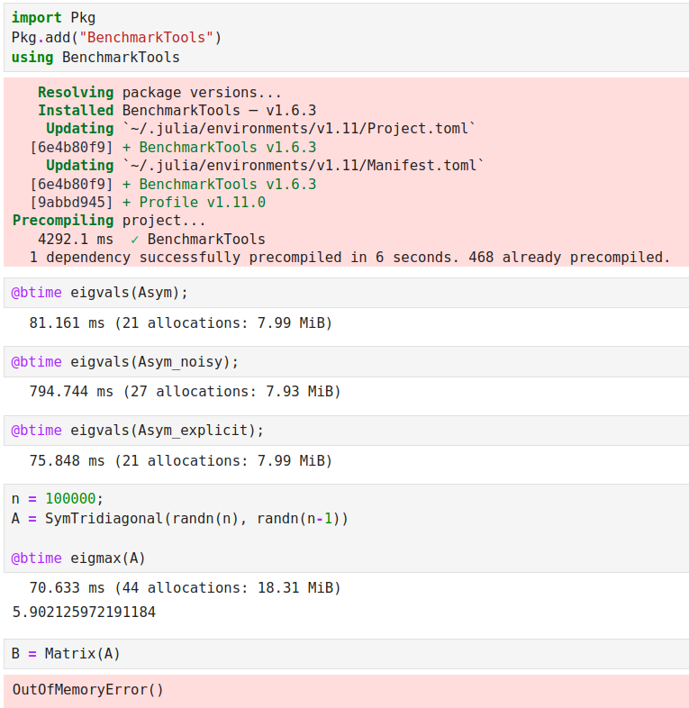{ #fig:027 width=100% height=100% }

## Общая линейная алгебра

ulia также поддерживает общую линейную алгебру, что позволяет,
например, работать с матрицами и векторами рациональных чисел. В следующем примере показано, как можно решить систему линейных уравнений с рациональными элементами без преобразования в типы элементов с плавающей запятой (для избежания проблемы с переполнением используем BigInt) (рис. [-@fig:028], [-@fig:029]).

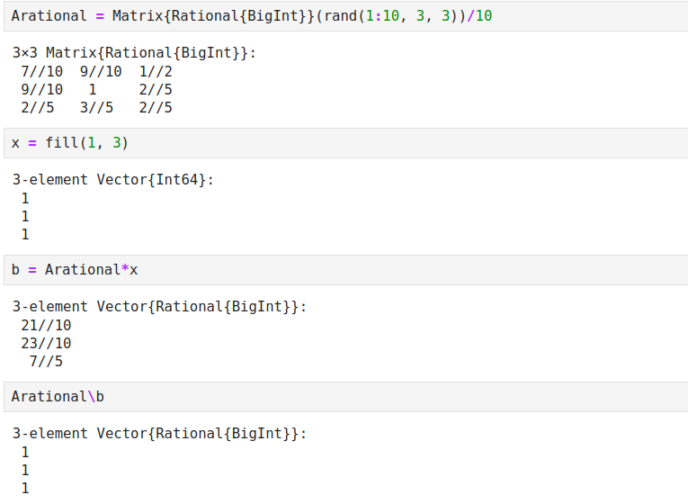{ #fig:028 width=100% height=100% }

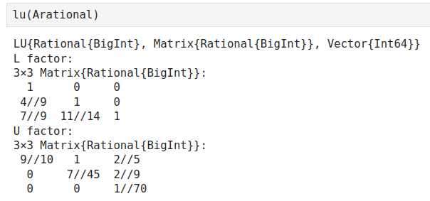{ #fig:029 width=100% height=100% }

## Задания для самостоятельного выполнения

Зададим вектор v. Умножим вектор v скалярно сам на себя и сохраним результат в dot_v (рис. [-@fig:030]).

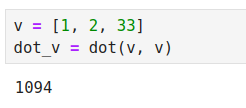{ #fig:030 width=100% height=100% }

Умножим v матрично на себя (внешнее произведение), присвоив результат переменной outer_v (рис. [-@fig:031]).

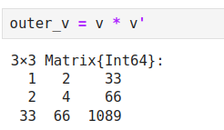{ #fig:031 width=100% height=100% }

Решим СЛАУ с двумя неизвестными.

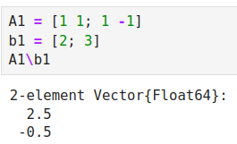{ #fig:032 width=100% height=100% }

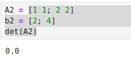{ #fig:033 width=100% height=100% }

Система не имеет решения (рис. [-@fig:033]).

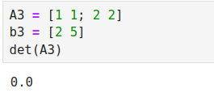{ #fig:034 width=100% height=100% }

Система не имеет решения (рис. [-@fig:034]).

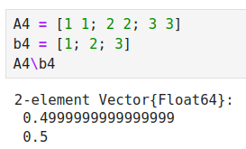{ #fig:035 width=100% height=100% }

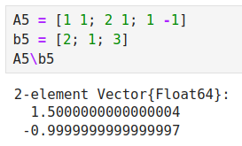{ #fig:036 width=100% height=100% }

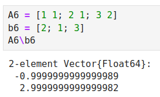{ #fig:037 width=100% height=100% }

Решим СЛАУ с тремя неизветными.

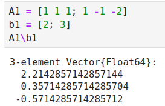{ #fig:038 width=100% height=100% }

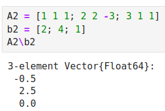{ #fig:039 width=100% height=100% }

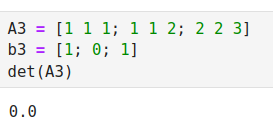{ #fig:040 width=100% height=100% }

Система не имеет решения (рис. [-@fig:040]).

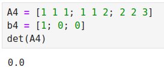{ #fig:041 width=100% height=100% }

Система не имеет решения (рис. [-@fig:041]).

Приведем приведенные ниже матрицы к диагональному виду.

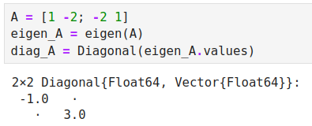{ #fig:042 width=100% height=100% }

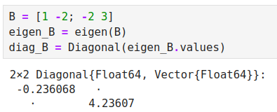{ #fig:043 width=100% height=100% }

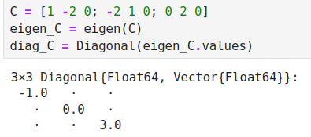{ #fig:044 width=100% height=100% }

Вычислим выражения. 

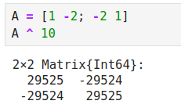{ #fig:045 width=100% height=100% }

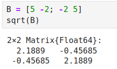{ #fig:046 width=100% height=100% }

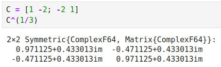{ #fig:047 width=100% height=100% }

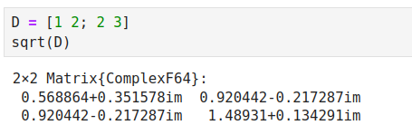{ #fig:048 width=100% height=100% }

Найдем собственные значения матрицы А.

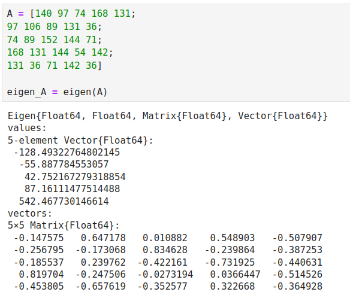{ #fig:049 width=100% height=100% }

Оценим эффективность выполняемых операций (рис. [-@fig:050]).

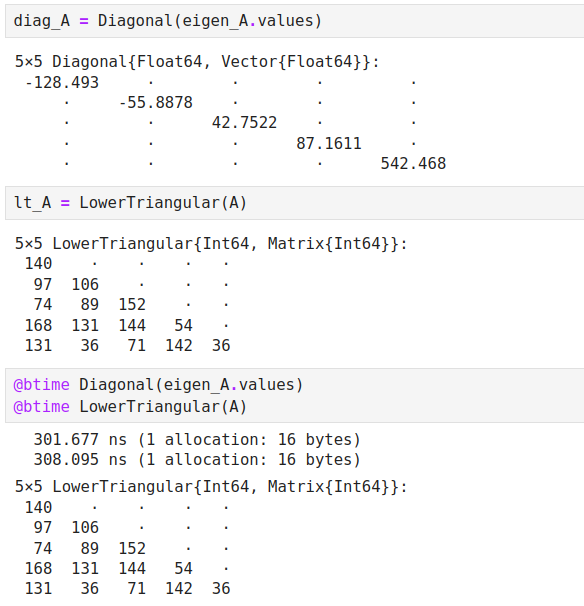{ #fig:050 width=100% height=100% }

Определим, являются ли матрицы продуктивными (рис. [-@fig:051]-[-@fig:053]).

{ #fig:051 width=100% height=100% }

{ #fig:052 width=100% height=100% }

{ #fig:053 width=100% height=100% }

# Вывод

Изучили возможности специализированных пакетов Julia для выполнения и оценки эффективности операций над объектами линейной алгебры.