---
## Front matter
lang: ru-RU
title: Лабораторная работа №6
subtitle: Решение моделей в непрерывном и дискретном времени
author:
  - Клюкин М. А.
institute:
  - Российский университет дружбы народов, Москва, Россия
  

## i18n babel
babel-lang: russian
babel-otherlangs: english

## Formatting pdf
toc: false
toc-title: Содержание
slide_level: 2
aspectratio: 169
section-titles: true
theme: metropolis
header-includes:
 - \metroset{progressbar=frametitle,sectionpage=progressbar,numbering=fraction}
 - \usepackage{fontspec}
 - \usepackage{polyglossia}
 - \setmainlanguage{russian}
 - \setotherlanguage{english}
 - \newfontfamily\cyrillicfont{Arial}
 - \newfontfamily\cyrillicfontsf{Arial}
 - \newfontfamily\cyrillicfonttt{Arial}
 - \setmainfont{Arial}
 - \setsansfont{Arial}
 
---

## Докладчик

:::::::::::::: {.columns align=center}
::: {.column width="70%"}

  * Клюкин Михаил Александрович
  * студент
  * Российский университет дружбы народов
  * [1132226431@pruf.ru](mailto:1132226431@pfur.ru)
  * <https://MaKYaro.github.io/ru/>

:::
::: {.column width="30%"}

:::
::::::::::::::

## Цель работы

Основной целью работы является освоение специализированных пакетов для решения задач в непрерывном и дискретном времени.

## Задание

1. Используя Jupyter Lab, повторите примеры из раздела 6.2.

2. Выполните задания для самостоятельной работы.

# Выполнение лабораторной работы

## Модель экспоненциального роста

{ #fig:001 width=70% height=70% }

## Модель экспоненциального роста

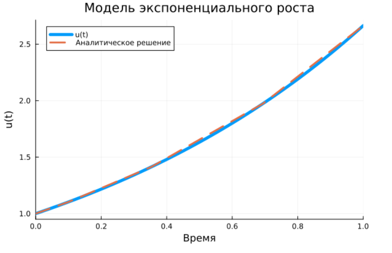{ #fig:002 width=70% height=70% }

## Модель экспоненциального роста

{ #fig:003 width=100% height=100% }

## Модель экспоненциального роста

{ #fig:004 width=70% height=70% }

## Система Лоренца

{ #fig:005 width=80% height=80% }

## Система Лоренца

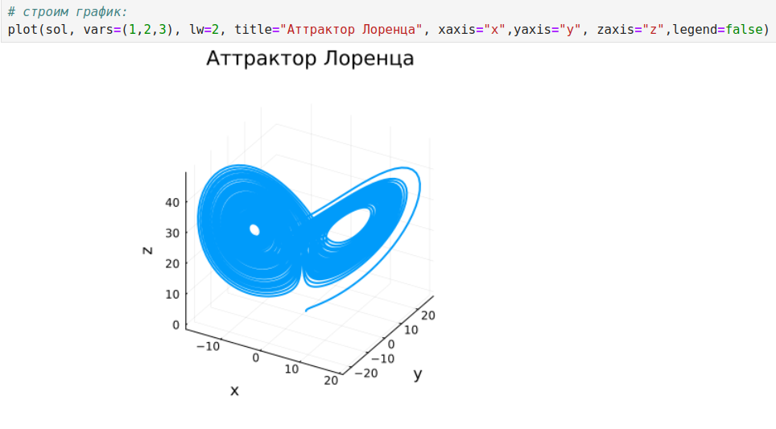{ #fig:006 width=80% height=80% }

## Система Лоренца

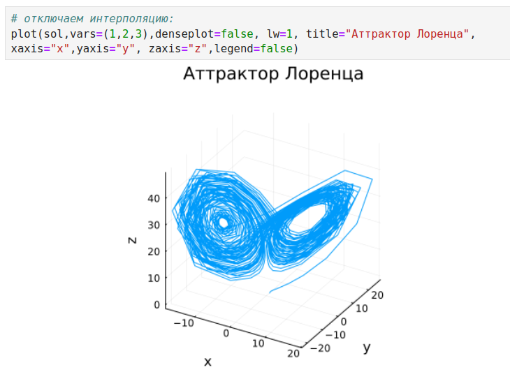{ #fig:007 width=80% height=80% }

## Модель Лотки-Вольтерры

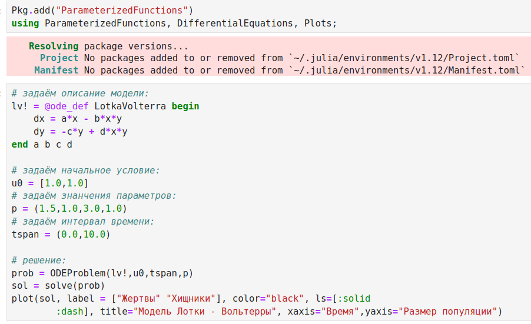{ #fig:008 width=80% height=80% }

## Модель Лотки-Вольтерры

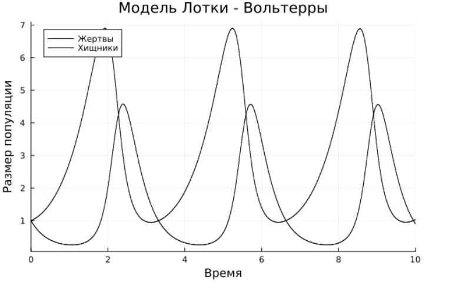{ #fig:009 width=80% height=80% }

## Модель Лотки-Вольтерры

{ #fig:010 width=80% height=80% }

# Задания для самостотельного выполнения

## Задание 1

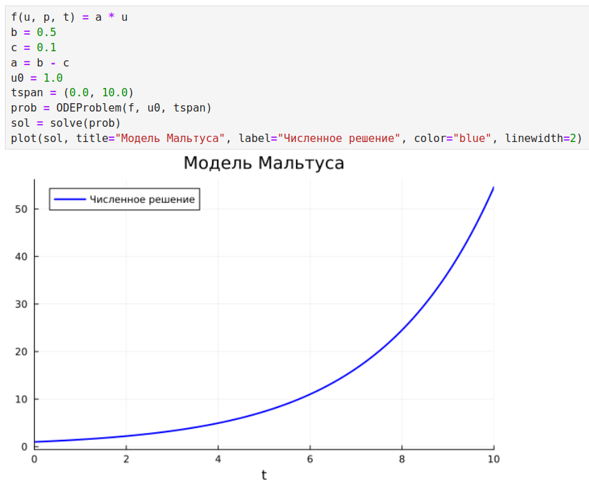{ #fig:011 width=80% height=80% }

## Задание 1

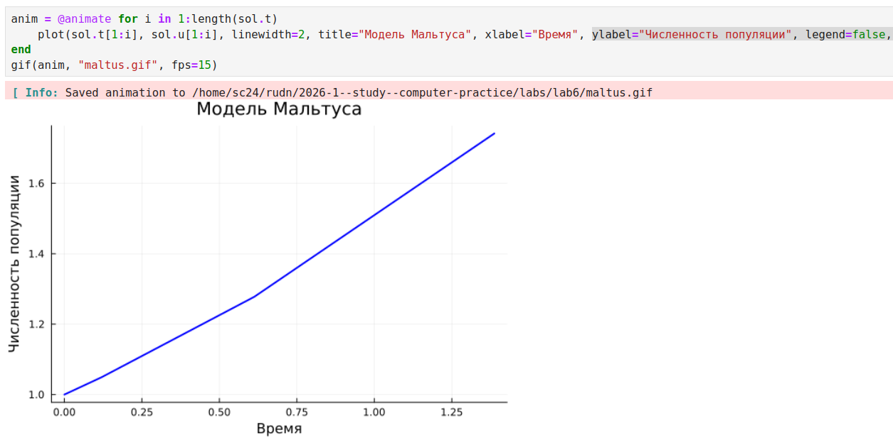{ #fig:012 width=90% height=90% }

## Задание 2

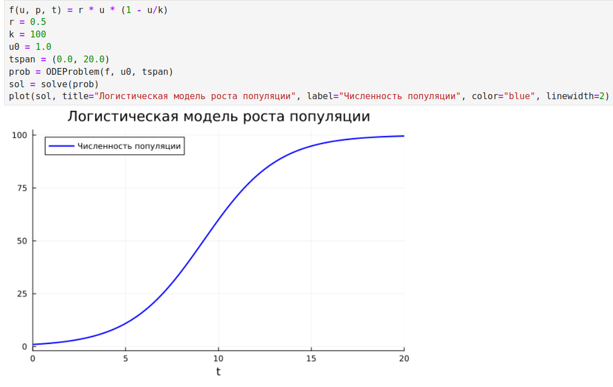{ #fig:013 width=80% height=80% }

## Задание 2

{ #fig:014 width=80% height=80% }

## Задание 3

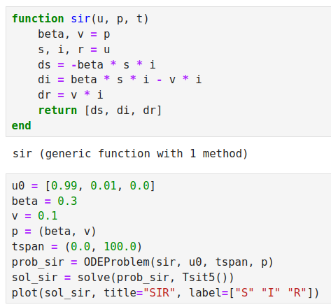{ #fig:015 width=80% height=80% }

## Задание 3

{ #fig:016 width=80% height=80% }

## Задание 3

{ #fig:017 width=80% height=80% }

## Задание 4

{ #fig:018 width=80% height=80% }

## Задание 4

{ #fig:019 width=80% height=80% }

## Задание 5

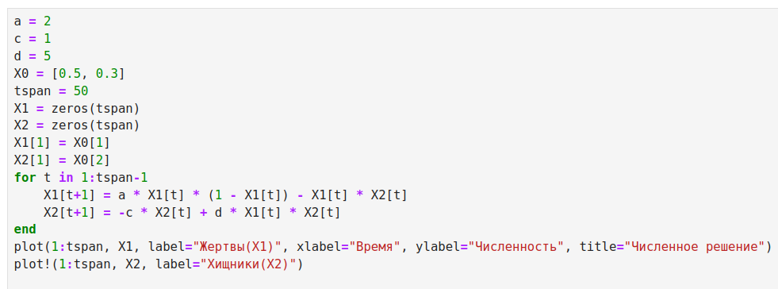{ #fig:020 width=80% height=80% }

## Задание 5

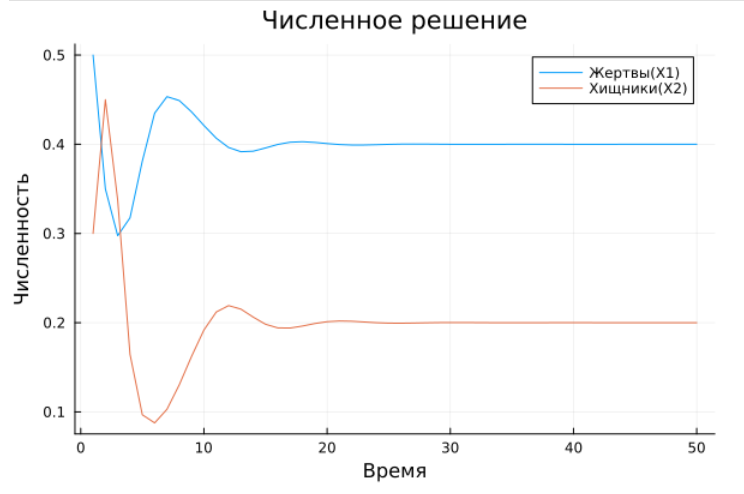{ #fig:021 width=80% height=80% }

## Задание 5

{ #fig:022 width=80% height=80% }

## Задание 6

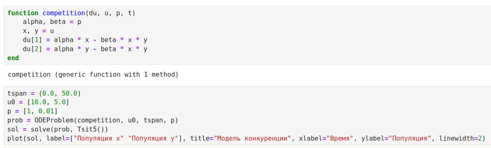{ #fig:023 width=80% height=80% }

## Задание 6

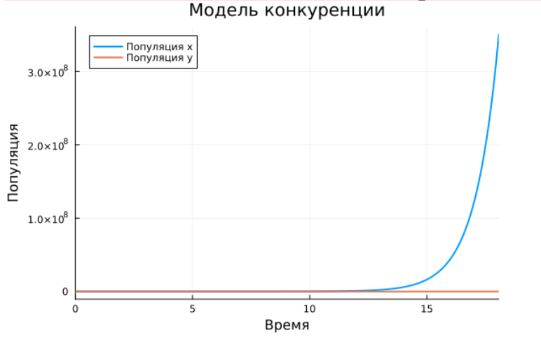{ #fig:024 width=80% height=80% }

## Задание 6

{ #fig:025 width=80% height=80% }

## Задание 7

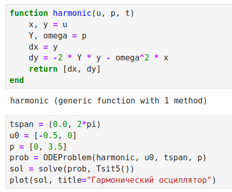{ #fig:026 width=80% height=80% }

## Задание 7

{ #fig:027 width=80% height=80% }

## Задание 7

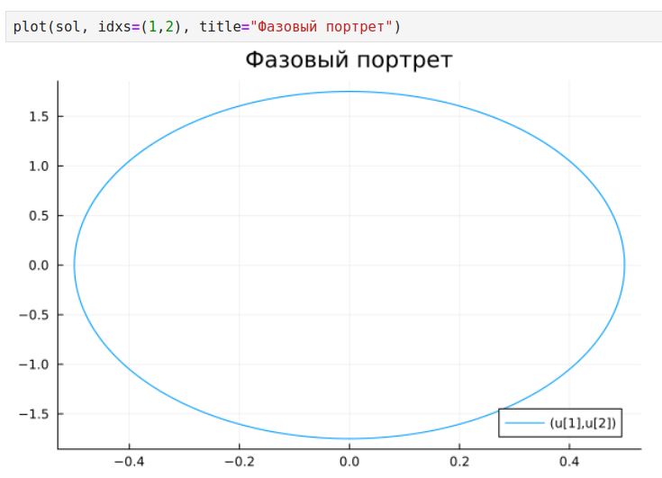{ #fig:028 width=80% height=80% }

## Задание 8

{ #fig:029 width=80% height=80% }

## Задание 8

{ #fig:030 width=80% height=80% }

## Вывод

В результате выполнения лабораторной работы освоили специализированные пакеты для решения задач в непрерывном и дискретном времени.