---
## Front matter
title: "Лабораторная работа №6"
subtitle: "Решение моделей в непрерывном и дискретном времени"
author: "Клюкин Михаил Александрович"

## Generic otions
lang: ru-RU
toc-title: "Содержание"

## Bibliography
bibliography: bib/cite.bib
csl: pandoc/csl/gost-r-7-0-5-2008-numeric.csl

## Pdf output format
toc: true # Table of contents
toc-depth: 2
lof: true # List of figures
lot: true # List of tables
fontsize: 12pt
linestretch: 1.5
papersize: a4
documentclass: scrreprt
## I18n polyglossia
polyglossia-lang:
  name: russian
  options:
	- spelling=modern
	- babelshorthands=true
polyglossia-otherlangs:
  name: english
## I18n babel
babel-lang: russian
babel-otherlangs: english
## Fonts
mainfont: IBM Plex Serif
romanfont: IBM Plex Serif
sansfont: IBM Plex Sans
monofont: IBM Plex Mono
mathfont: STIX Two Math
mainfontoptions: Ligatures=Common,Ligatures=TeX,Scale=0.94
romanfontoptions: Ligatures=Common,Ligatures=TeX,Scale=0.94
sansfontoptions: Ligatures=Common,Ligatures=TeX,Scale=MatchLowercase,Scale=0.94
monofontoptions: Scale=MatchLowercase,Scale=0.94,FakeStretch=0.9
mathfontoptions:
## Biblatex
biblatex: true
biblio-style: "gost-numeric"
biblatexoptions:
  - parentracker=true
  - backend=biber
  - hyperref=auto
  - language=auto
  - autolang=other*
  - citestyle=gost-numeric
## Pandoc-crossref LaTeX customization
figureTitle: "Рис."
tableTitle: "Таблица"
listingTitle: "Листинг"
lofTitle: "Список иллюстраций"
lotTitle: "Список таблиц"
lolTitle: "Листинги"
## Misc options
indent: true
header-includes:
  - \usepackage{indentfirst}
  - \usepackage{float} # keep figures where there are in the text
  - \floatplacement{figure}{H} # keep figures where there are in the text
---

# Цель работы

Основной целью работы является освоение специализированных пакетов для решения задач в непрерывном и дискретном времени.

# Задание

1. Используя Jupyter Lab, повторите примеры из раздела 6.2.

2. Выполните задания для самостоятельной работы.

# Выполнение лабораторной работы

## Решение обыкновенных дифференциальных уравнений

Напомним, что обыкновенное дифференциальное уравнение (ОДУ) описывает изменение некоторой переменной u.

Для решения обыкновенных дифференциальных уравнений (ОДУ) в Julia можно использовать пакет diffrentialEquations.jl.

### Модель экспоненциального роста

Рассмотрим пример использования этого пакета для решение уравнения модели экспоненциального роста, описываемую уравнением, где a — коэффициент роста.    

Численное решение в Julia будет иметь следующий вид и график соответсвующий полученному решению (рис. [-@fig:001] - [-@fig:002]):

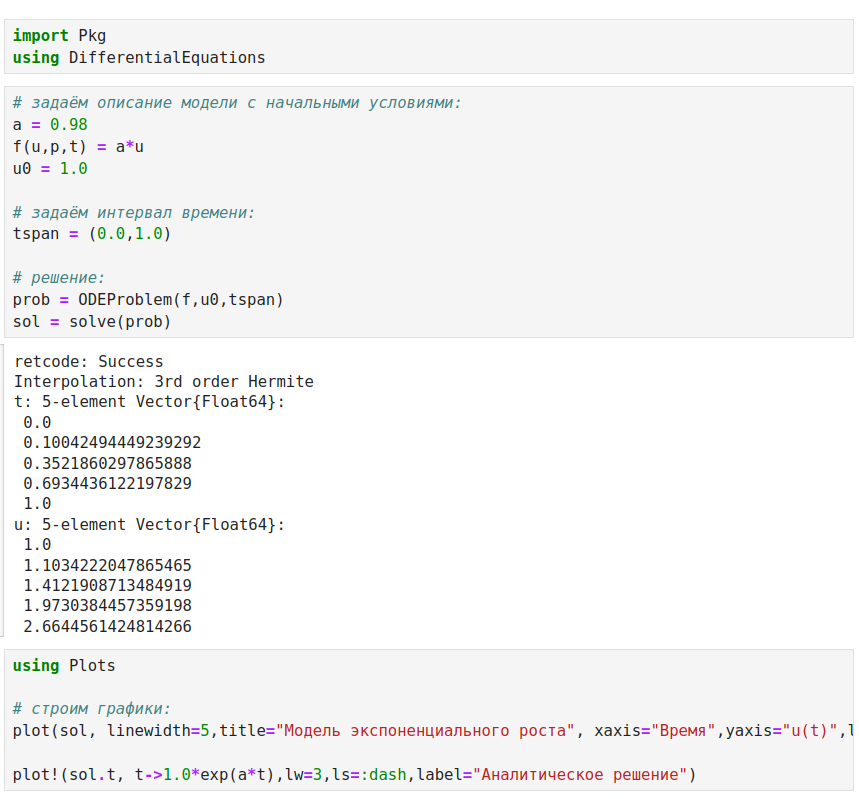{ #fig:001 width=100% height=100% }

{ #fig:002 width=100% height=100% }

При построении одного из графиков использовался вызов sol.t, чтобы захватить массив моментов времени. Массив решений можно получить, воспользовавшись sol.u.  

Если требуется задать точность решения, то можно воспользоваться параметрами abstol (задаёт близость к нулю) и reltol (задаёт относительную точность). По умолчанию эти параметры имеют значение abstol = 1e-6 и reltol = 1e-3.   

Для модели экспоненциального роста (рис. [-@fig:003] - [-@fig:004]):

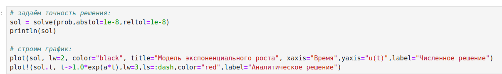{ #fig:003 width=100% height=100% }

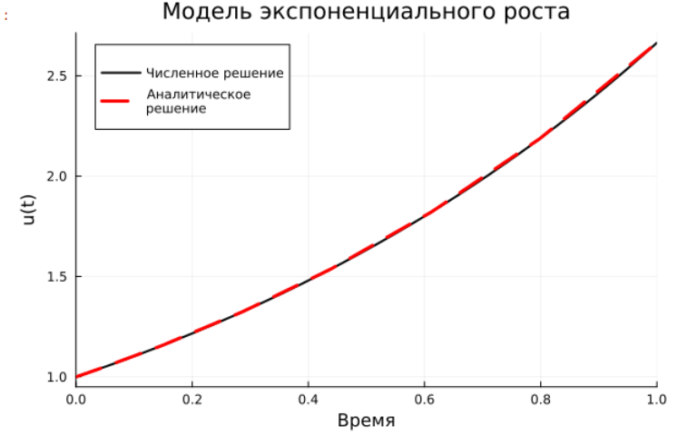{ #fig:004 width=100% height=100% }

### Система Лоренца

Динамической системой Лоренца является нелинейная автономная система обыкновенных дифференциальных уравнений третьего порядка.   

Система (6.2) получена из системы уравнений Навье–Стокса и описывает движение воздушных потоков в плоском слое жидкости постоянной толщины при разложении скорости течения и температуры в двойные ряды Фурье с последующем усечением до первых-вторых гармоник.    

Решение системы неустойчиво на аттракторе, что не позволяет применять классические численные методы на больших отрезках времени, требуется использовать высокоточные вычисления.   

Численное решение в Julia будет иметь следующий вид и график (рис. [-@fig:005] - [-@fig:006]):

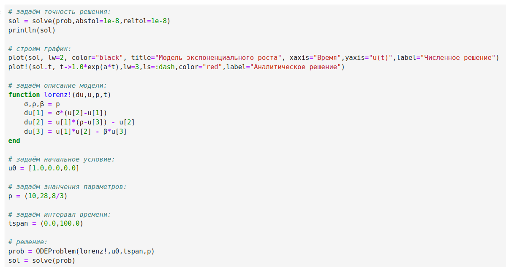{ #fig:005 width=100% height=100% }

{ #fig:006 width=100% height=100% }

Можно отключить интерполяцию (рис. [-@fig:007]).

{ #fig:007 width=100% height=100% }

## Модель Лотки-Вольтерры

Модель Лотки–Вольтерры описывает взаимодействие двух видов типа «хищник – жертва»:

Численное решение в Julia будет иметь следующий вид, а также график (рис. [-@fig:008] - [-@fig:009]).

{ #fig:008 width=100% height=100% }

{ #fig:009 width=100% height=100% }

Фазовый портрет (рис. [-@fig:010]).

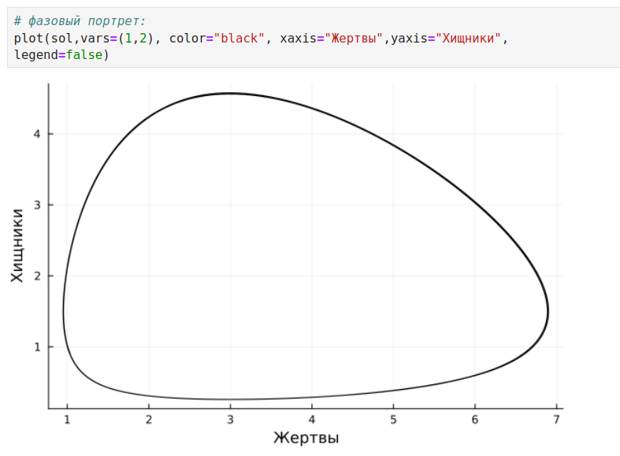{ #fig:010 width=100% height=100% }

# Задания для самостотельного выполнения

Выполнение задания 1 (рис. [-@fig:011] - [-@fig:012]):

{ #fig:011 width=100% height=100% }

{ #fig:012 width=100% height=100% }

Выполнение задания 2 (рис. [-@fig:013] - [-@fig:014]):

{ #fig:013 width=100% height=100% }

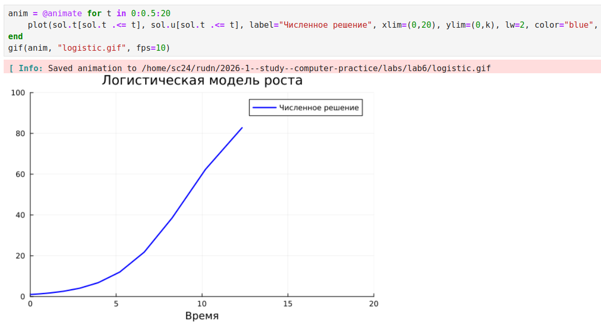{ #fig:014 width=100% height=100% }

Выполнение задания 3 (рис. [-@fig:015] - [-@fig:017]):

{ #fig:015 width=100% height=100% }

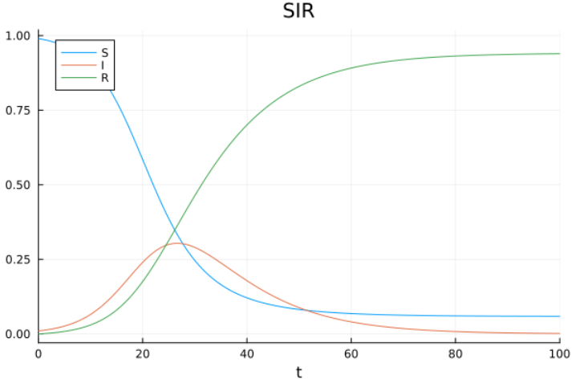{ #fig:016 width=100% height=100% }

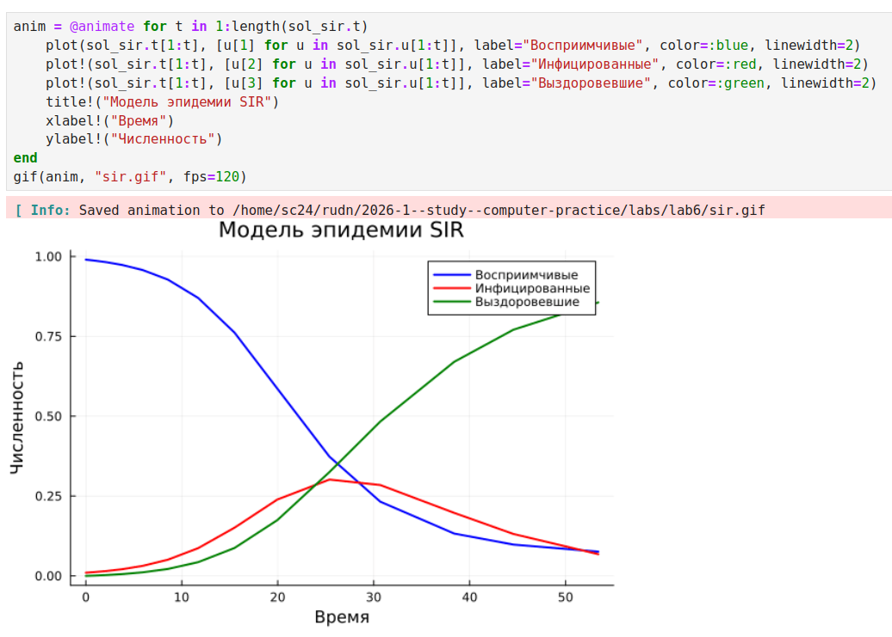{ #fig:017 width=100% height=100% }

Выполнение задания 4 (рис. [-@fig:018] - [-@fig:019]):

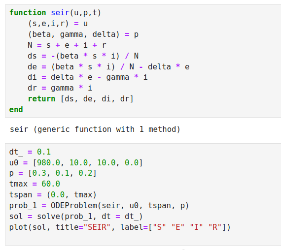{ #fig:018 width=100% height=100% }

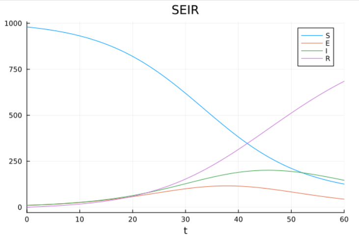{ #fig:019 width=100% height=100% }

Выполнение задания 5 (рис. [-@fig:020] - [-@fig:022]):

{ #fig:020 width=100% height=100% }

{ #fig:021 width=100% height=100% }

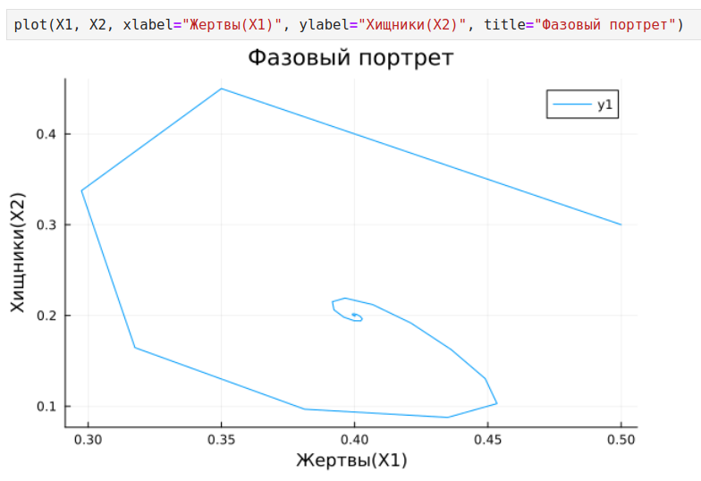{ #fig:022 width=100% height=100% }

Выполнение задания 6 (рис. [-@fig:023] - [-@fig:025]):

{ #fig:023 width=100% height=100% }

{ #fig:024 width=100% height=100% }

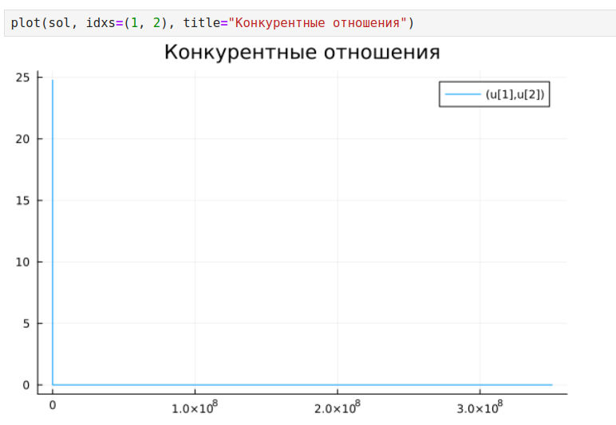{ #fig:025 width=100% height=100% }

Выполнение задания 7 (рис. [-@fig:026] - [-@fig:028]):

{ #fig:026 width=100% height=100% }

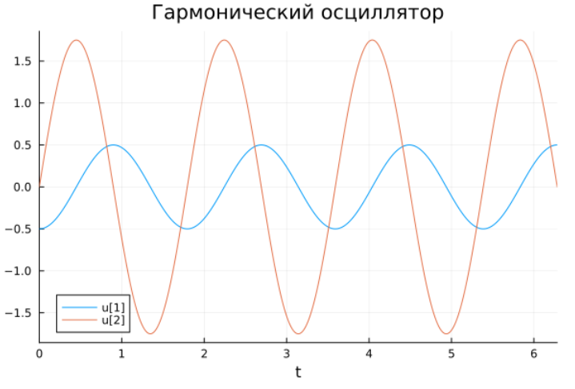{ #fig:027 width=100% height=100% }

{ #fig:028 width=100% height=100% }

Выполнение задания 8 (рис. [-@fig:029] - [-@fig:030]):

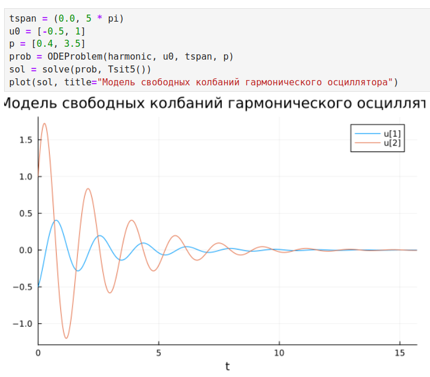{ #fig:029 width=100% height=100% }

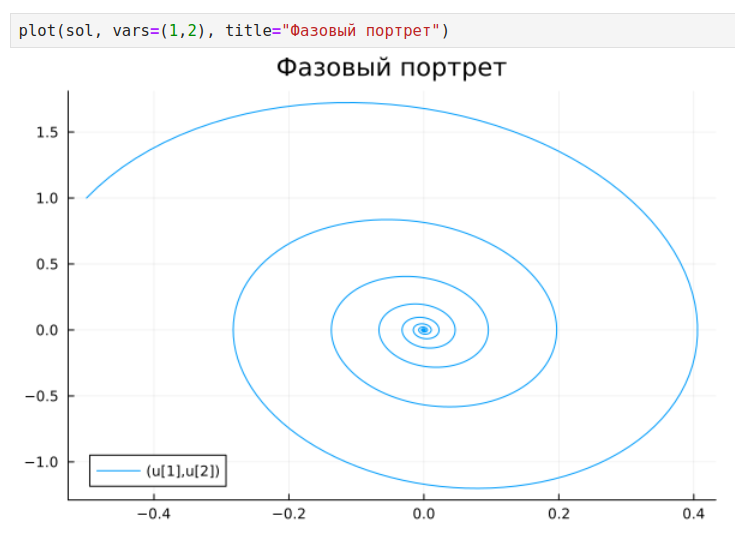{ #fig:030 width=100% height=100% }

# Вывод

В результате выполнения лабораторной работы освоили специализированные пакеты для решения задач в непрерывном и дискретном времени.